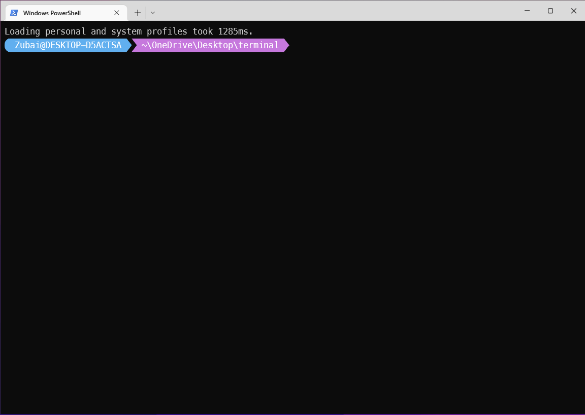

# My terminal

<a href="https://ohmyposh.dev/"></a>
 
## *1*.Install Font <a href='https://github.com/ryanoasis/nerd-fonts/releases/download/v2.1.0/Meslo.zip'> Nerd Font<a/> </br>
## *2*.Change Font from *Termilam* and also change Termilam Font From *VS Code* </br>
## *3*.Run The Code In  The Terminal *code $profile or notepad $PROFILE*
```dart
oh-my-posh --init --shell pwsh --config ~\AppData\Local\Programs\oh-my-posh\themes\blueish.omp.json | Invoke-Expression
Set-Alias neofetch winfetch
Remove-Item Alias:curl
clear
```
## *4*.Run The Code In  The Terminal 
```dart
Set-ExecutionPolicy -Scope CurrentUser -ExecutionPolicy Bypass -Force
```

